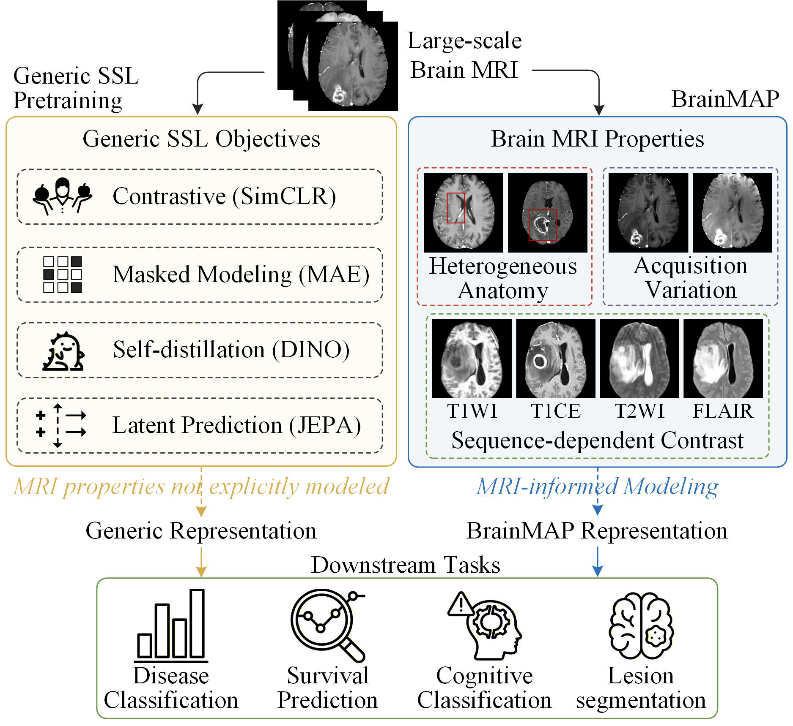
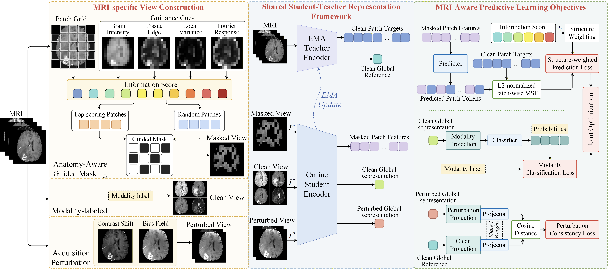

# BrainMAP: MRI-Aware Predictive Representation Learning for a Domain-Specific Brain Foundation Model

BrainMAP is an MRI-aware predictive representation learning framework for developing a domain-specific brain foundation model.

## Abstract

Magnetic resonance imaging (MRI) plays a central role in the diagnosis and follow-up of brain tumors, neurodegenerative diseases, stroke, and other neurological disorders. Foundation models offer a promising representation-learning paradigm for brain MRI analysis across diverse tasks. However, existing approaches often adapt generic self-supervised objectives without explicitly modeling sequence-dependent tissue contrast, heterogeneous anatomical structures, and nonpathological acquisition perturbations in brain MRI. We propose BrainMAP, an MRI-aware predictive representation learning framework for developing a domain-specific brain foundation model. Built on masked latent prediction, BrainMAP incorporates modality-supervised representation learning, anatomy-guided masked latent prediction, and perturbation consistency learning within a unified student-teacher framework. These objectives introduce MRI-specific modality, structural, and acquisition characteristics into predictive representation learning. BrainMAP is pretrained on a large-scale brain MRI pool assembled from 14 public datasets, yielding 2,815,620 axial 2D pretraining samples from processed 3D scans, and is evaluated across multiple downstream tasks. Experimental results demonstrate effective transfer of BrainMAP representations, with further evaluation through linear probing, limited-label adaptation, and artifact perturbation experiments. The code will be publicly available at: https://github.com/Hang3Y/BrainMAP.

## Motivation



**Figure 1.** Generic self-supervised pretraining versus BrainMAP for brain MRI. Generic objectives overlook MRI-specific properties, whereas BrainMAP explicitly models modality-dependent tissue contrast, heterogeneous anatomy, and acquisition-related appearance variation.

## Framework



**Figure 2.** Overview of BrainMAP. The framework includes MRI-specific view construction, a shared student-teacher representation framework, and MRI-aware predictive learning objectives. A masked view, a modality-labeled clean view, and an acquisition-perturbed view are constructed from the same MRI. The student encodes all three views, whereas the EMA teacher processes only the clean view to provide patch targets and a global reference. Structure-weighted masked latent prediction, modality classification, and perturbation consistency jointly optimize the student, while the teacher is updated by exponential moving average.

## Pretraining Data

BrainMAP was pretrained on a large-scale brain MRI pool assembled from 14 public datasets. The table below summarizes the retained MRI scan counts after dataset-specific processing, available MRI sequences, and the applied skull-stripping and N4 bias-correction procedures. Dataset names link to their official data sources. A dash indicates that a sequence was unavailable or that the corresponding processing step was not applied.

| Dataset | T1WI | T1CE | T2WI | FLAIR | Total volumes | Skull stripping | N4 correction |
|---|---:|---:|---:|---:|---:|:---:|:---:|
| [ABIDE](https://fcon_1000.projects.nitrc.org/indi/abide/abide_II.html) | 1,113 | - | - | 81 | 1,194 | Yes | Yes |
| [BraTS](https://www.synapse.org/#!Synapse:syn51156910/wiki/622351) | 1,470 | 1,470 | 1,470 | 1,470 | 5,880 | - | - |
| [ATLAS](https://atlas.grand-challenge.org/ATLAS/) | 955 | - | - | - | 955 | Yes | Yes |
| [ISLES](https://isles22.grand-challenge.org/home/) | - | - | - | 250 | 250 | - | Yes |
| [Medical Segmentation Decathlon](http://medicaldecathlon.com/) | 750 | 750 | 750 | 750 | 3,000 | - | - |
| [IXI](https://brain-development.org/ixi-dataset/) | 581 | - | 578 | - | 1,159 | Yes | Yes |
| [Learn2Reg](https://learn2reg.grand-challenge.org/Datasets/) | 453 | - | - | - | 453 | - | - |
| [BrainMetShare](https://stanfordaimi.azurewebsites.net/datasets/f1253510-6ab3-4723-97e7-37d2af1ee898) | 156 | 312 | - | 156 | 624 | - | - |
| [LUMIERE](https://springernature.figshare.com/collections/The_LUMIERE_Dataset_Longitudinal_Glioblastoma_MRI_with_Expert_RANO_Evaluation/5904905) | 400 | 400 | 400 | 400 | 1,600 | - | - |
| [WMH](https://dataverse.nl/dataset.xhtml?persistentId=doi:10.34894/AECRSD) | 340 | - | - | 170 | 510 | Yes | Yes |
| [UCSD-PTGBM](https://www.cancerimagingarchive.net/collection/ucsd-ptgbm/) | 243 | 243 | 230 | 243 | 959 | - | - |
| [UPENN-GBM](https://www.cancerimagingarchive.net/collection/upenn-gbm/) | 671 | 671 | 671 | 671 | 2,684 | - | - |
| [UCSF-PDGM](https://www.cancerimagingarchive.net/collection/ucsf-pdgm/) | 501 | 501 | 501 | 501 | 2,004 | - | - |
| [ReMIND](https://www.cancerimagingarchive.net/collection/remind/) | 24 | 166 | 243 | 90 | 523 | - | Yes |
| **Total** | **7,657** | **4,513** | **4,843** | **4,782** | **21,795** | - | - |

## Repository Status

This repository currently provides the public method implementation and data-preprocessing utilities:

- Model architecture and EMA teacher.
- Anatomy-frequency-guided masking and pretraining objective definitions.
- WebDataset data contract and modality mapping.
- Brain MRI preprocessing and WebDataset packaging utilities.
- Reference configuration for BrainMAP pretraining.
- Pretraining dataset inventory and dataset-specific processing summary.

Additional materials will be released according to the progress of the paper.

## Directory Structure

```text
brainmap/
|-- assets/          # Repository figures
|-- config/          # Reference pretraining configuration
|-- data/            # Data contract, loader, and modality mapping
|-- masking/         # Anatomy-frequency-guided masking
|-- model/           # BrainMAP model architecture
|-- objectives/      # Pretraining objective definitions
|-- preprocessing/   # Brain MRI preprocessing and WebDataset packaging
`-- utils/           # Shared utility modules
```


## Notice

This repository is intended for academic research communication. Do not redistribute private medical images, non-public annotations, checkpoints, trained weights, or experiment logs unless they are explicitly approved for public release.
